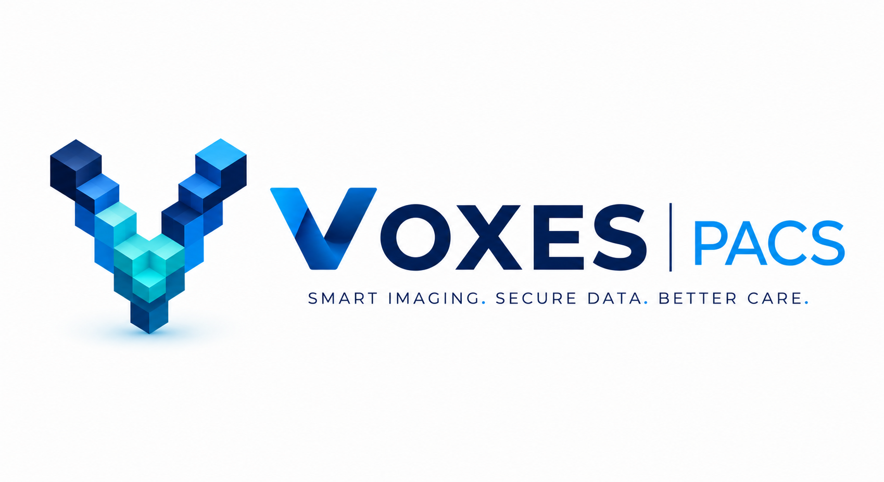

# VOXEL PACS — Sistema de Gestão PACS



Plataforma PHP 8.1 Multi-Tenant para gestão de exames DICOM, integrada nativamente ao **Orthanc PACS** e ao **OHIF Viewer**. Projetada para alta performance em ambientes de hospedagem compartilhada (LiteSpeed) ou containers Docker.

---

## 📋 Descrição do Projeto

O **VOXEL PACS** é uma solução completa para clínicas radiológicas e centros de diagnóstico por imagem. Ele atua como um orquestrador entre o armazenamento de imagens (Orthanc) e a visualização médica (OHIF), adicionando camadas vitais de negócio: multi-tenancy, autenticação, controle de permissões (RBAC), monitoramento de SLA, geração de laudos com assinatura digital e indicadores de produtividade.

## 🏗 Arquitetura

O sistema é construído sobre uma arquitetura MVC (Model-View-Controller) customizada em PHP puro, sem dependência de frameworks pesados, garantindo máxima performance.

| Camada | Localização | Responsabilidade |
|---|---|---|
| **Controllers** | `app/Controllers/` | Recebe requisições HTTP, orquestra os Services |
| **Models** | `app/Models/` | Entidades e regras de negócio |
| **Services** | `app/Services/` | Lógica de negócio complexa (Orthanc, KPIs, Reports) |
| **Repositories** | `app/Repositories/`| Abstração de acesso ao banco de dados |
| **Views** | `app/Views/` | Templates PHP (layouts modulares) |
| **Core** | `app/Core/` | Router, Database, Auth, Logger, Base Middleware |
| **Middlewares** | `app/Middlewares/` | Interceptadores (Auth, CSRF, Tenant, Permissões) |
| **Routes** | `routes/` | Definição de endpoints (`web.php` e `platform.php`) |

## ⚙️ Dependências e Requisitos

- **PHP:** >= 8.1
- **Extensões PHP:** `pdo_mysql`, `gd`, `zip`, `mbstring`, `xml`, `opcache`
- **Banco de Dados:** MySQL 8.0 (Recomendado) ou MySQL 5.7 (Hostgator)
- **Servidor Web:** Apache (com `mod_rewrite`) ou LiteSpeed
- **Servidor PACS:** Orthanc (REST API ativada)
- **Visualizador DICOM:** OHIF Viewer (configurado para DICOMweb)

## 📁 Estrutura de Pastas

```text
/
├── app/               # Código-fonte principal (MVC + Services)
├── config/            # Configurações globais
├── database/          # Migrations SQL e Seeds
├── docs/              # Documentação técnica detalhada
├── public/            # DocumentRoot (index.php, assets, CSS, JS)
├── routes/            # Definição de rotas da aplicação
├── scripts/           # Scripts utilitários (deploy, build, sync)
├── storage/           # Logs, sessões e uploads temporários
├── tests/             # Testes unitários (PHPUnit)
└── vendor/            # Dependências do Composer
```

## 🚀 Como Instalar e Configurar

### 1. Clonar o Repositório

```bash
git clone https://github.com/ASOARESBH/voxelpacs_2026.git
cd voxelpacs_2026
```

### 2. Instalar Dependências

```bash
composer install --no-dev --optimize-autoloader
```

### 3. Configurar o Ambiente

Copie o arquivo de exemplo e configure suas variáveis:

```bash
cp .env.example .env
# Edite o .env com suas credenciais de banco e URLs
```

> **Atenção:** Nunca commite o arquivo `.env` no repositório.

### 4. Configurar Permissões

Os diretórios de armazenamento precisam ter permissão de escrita:

```bash
chmod -R 775 storage/
```

### 5. Banco de Dados

Crie o banco de dados e execute as migrations localizadas em `database/migrations/` na ordem cronológica de seus nomes.

## 💻 Como Executar

### Ambiente de Desenvolvimento Local (PHP Built-in Server)

```bash
php -S localhost:8000 -t public/
```

### Via Docker (Recomendado)

O projeto inclui um `Dockerfile` pronto para uso:

```bash
docker build -t voxelpacs-api .
docker run -p 8080:80 -d voxelpacs-api
```

## 📦 Como Publicar (Deploy)

Para publicar no Hostgator ou outro ambiente de produção, utilize o script de build:

```bash
./scripts/build.sh
```

Este script irá gerar um arquivo `.zip` otimizado, sem arquivos de desenvolvimento, pronto para ser extraído na pasta `public_html` do servidor.

## 🔄 Fluxo Git e Convenções

Este projeto segue um fluxo simplificado:

- `main`: Código em produção, sempre estável.
- `development`: Branch de integração para novas funcionalidades.
- **Commits:** Devem seguir o padrão [Conventional Commits](https://www.conventionalcommits.org/) (ex: `feat: adiciona módulo de laudos`, `fix: corrige erro no login`).

## 📚 Documentação Adicional

Consulte a pasta `docs/` para documentação técnica aprofundada:

- [Manual Técnico Completo](docs/MANUAL_TECNICO.md)
- [Arquitetura de Banco de Dados](docs/BANCO_DE_DADOS.md)
- [Deploy no Hostgator](docs/DEPLOY_HOSTGATOR.md)
- [Módulo de Estudos](docs/MODULO_ESTUDOS.md)
- [Módulo de Relatórios](docs/MODULO_REPORTS.md)
- [Sincronização PACS](docs/SYNC_AUTOMATICO_PACS.md)

---
*VOXEL PACS — Desenvolvido para transformar a gestão radiológica.*
