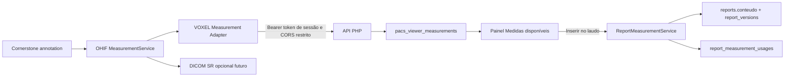

# VOXEL Measurement Integration Layer — Contrato técnico v1

## Objetivo

Integrar medições produzidas pelo `MeasurementService` do OHIF no VOXEL VIEW ao laudário do VOXEL PACS. O médico poderá consultar medições do estudo, selecionar uma ou mais, copiá-las e inseri-las em uma seção do laudo, com rastreabilidade clínica e sem duplicar o estado de medição no viewer.

> O `MeasurementService` permanece como a fonte de verdade durante a sessão do viewer. O backend armazena somente **snapshots normalizados** recebidos por um adapter do VOXEL VIEW, associados de forma imutável ao estudo, tenant e usuário da sessão.

## Fluxo

## Sessão do adapter

A abertura do estudo já passa pelo token opaco `pacs_viewer_tokens`. Quando este token é validado pelo `ViewerTokenController`, o servidor cria uma credencial específica de adapter:

| Requisito | Regra |
|---|---|
| Formato | 32 bytes aleatórios codificados em hexadecimal |
| Persistência | Somente `SHA-256` do token; o token bruto não vai ao banco |
| Escopo | Um estudo, um tenant e um usuário, derivados da sessão existente |
| Validade | Igual ou menor que a validade da abertura do viewer |
| Transporte inicial | Fragmento da URL (`#voxel_measurement_token=...`), removido imediatamente pelo adapter com `history.replaceState()` |
| Transporte de API | `Authorization: Bearer <token>`; nunca query string, cookie ou localStorage |
| Revogação | Campo `revogado_em`; expiração e hash são verificados em toda chamada |

O fragmento não é enviado ao Nginx nem ao backend no carregamento inicial. O adapter lê o valor em memória, limpa a URL e utiliza-o somente no header `Authorization` das chamadas HTTPS para `server.voxelpacs.com.br`.

## APIs

### `OPTIONS /api/viewer/measurements`

Preflight para o origin exato `https://view.voxelpacs.com.br`. Responde apenas com `POST, OPTIONS`, `Authorization, Content-Type` e `Cache-Control: no-store`.

### `POST /api/viewer/measurements`

Endpoint sem sessão PHP, protegido pelo token bearer do adapter.

| Campo enviado | Regra |
|---|---|
| `action` | `upsert`, `remove` ou `sync` |
| `study_instance_uid` | Deve ser idêntico ao estudo da sessão bearer |
| `measurement` | Snapshot normalizado e validado; sem identidade de paciente ou usuário enviada pelo browser |
| `measurement.uid` | Obrigatório, usado para deduplicação dentro da sessão |
| `measurement.tool_name` | Lista permitida de ferramentas mapeadas na versão OHIF v3.12.5 |

O servidor deriva `tenant_id`, `estudo_id`, `usuario_id`, `viewer_session_id` e data de captura exclusivamente do token. Updates substituem o snapshot mais recente do mesmo `viewer_session_id + measurement_uid`; remoções marcam a measurement como removida. Toda falha de escrita é registrada em `Logger::error()`.

### `GET /api/reports/measurements?report_id={id}`

Endpoint autenticado pela sessão atual do laudário. Confere tenant e estudo do report, retorna apenas snapshots ativos do mesmo estudo e aplica `Cache-Control: no-store`.

### `POST /api/reports/measurements/insert`

Endpoint autenticado por sessão PHP e CSRF. Recebe `report_id`, `measurement_ids` e `secao_destino` e executa em transação:

1. Confere tenant, estudo, status editável e lock do report.
2. Busca as medições ativas pertencentes ao mesmo estudo.
3. Gera texto clínico determinístico no servidor.
4. Atualiza `reports.conteudo` e cria `report_versions`.
5. Grava `report_measurement_usages` para rastreabilidade e bloqueio de duplicidade acidental.
6. Retorna as seções canônicas para o Quill.

Nenhuma medição é confiada ao payload de inserção do browser; o browser informa apenas os IDs. O valor, unidade e proveniência são relidos no banco.

## Modelo de dados

| Tabela | Finalidade |
|---|---|
| `pacs_viewer_measurement_sessions` | Token hash, escopo e expiração da sessão de integração do viewer |
| `pacs_viewer_measurements` | Snapshot atualizado das medições de uma sessão; buscável por estudo/ferramenta/texto e rastreável por UIDs DICOM |
| `report_measurement_usages` | Vínculo entre report, measurement, seção e texto efetivamente inserido |

A persistência de snapshots não substitui DICOM SR. DICOM SR continua sendo uma exportação clínica opcional do OHIF e será integrado em etapa específica, após validação STOW-RS e reidratação.

## Normalização de snapshot

O adapter encaminha uma cópia serializável. O servidor normaliza e mantém, quando disponíveis: `uid`, `tool_name`, `source_name`, `source_version`, `study_instance_uid`, `series_instance_uid`, `sop_instance_uid`, `frame_number`, `frame_of_reference_uid`, `label`, `display_value`, `numeric_value`, `unit`, `points` e `raw_payload`.

Valores não devem ser extraídos por uma única propriedade. Na versão OHIF v3.12.5, `Length`, por exemplo, pode manter stats em `data.cachedStats`; o adapter prioriza `displayText`, depois stats específicos por ferramenta, e envia um snapshot com formato estável para o backend.

## UX no laudário

O painel **Medidas disponíveis do viewer** aparece na coluna clínica do laudário. Ele apresenta estado vazio, atualização periódica discreta, seleção por checkbox, contagem, ferramenta, valor e unidade. `Inserir no laudo` fica desabilitado até haver seleção e em modo somente leitura. `Copiar` usa a Clipboard API apenas após gesto explícito do médico.

A inserção usa a seção `Achados` como padrão e retorna o documento canônico salvo pelo servidor; a interface recarrega apenas as seções retornadas. Isso evita que um texto apareça visualmente no editor sem a respectiva versão/auditoria do report.

## Critérios de segurança e qualidade

- Prepared statements, validação de servidor e `htmlspecialchars()` para qualquer saída PHP.
- CORS somente para `https://view.voxelpacs.com.br`; sem cookies ou credenciais cross-site.
- Token bearer hash, expiração, escopo por estudo/tenant/usuário e `Cache-Control: no-store`.
- Compatibilidade MySQL 5.7 / HostGator, charset `utf8` e collation `utf8_unicode_ci`.
- Índices para lookup por estudo/tenant/status e deduplicação por sessão/UID.
- Transação para inserir medida no laudo e gerar versão/auditoria de forma atômica.
- Logs para erros de escrita e auditoria apenas em ações clínicas relevantes, sem registrar cada arraste de annotation.
- Sem alteração de `MeasurementService`, mappers do OHIF, Orthanc, DICOMweb ou DICOM SR nesta entrega.
